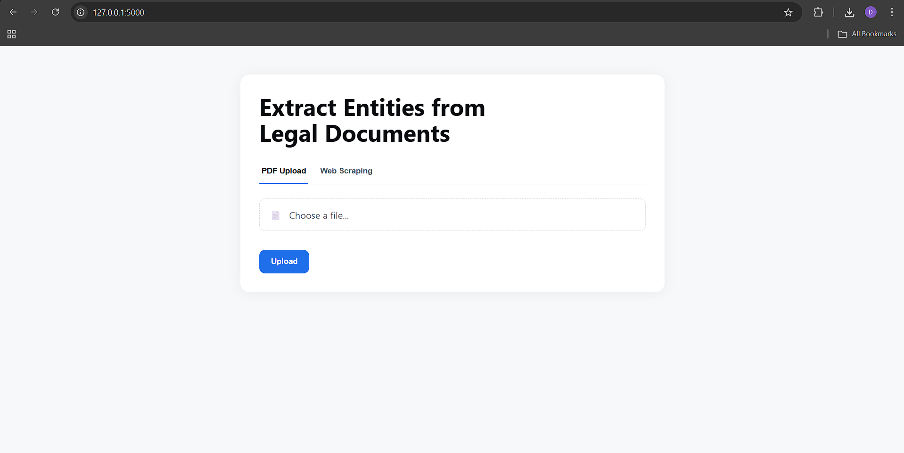
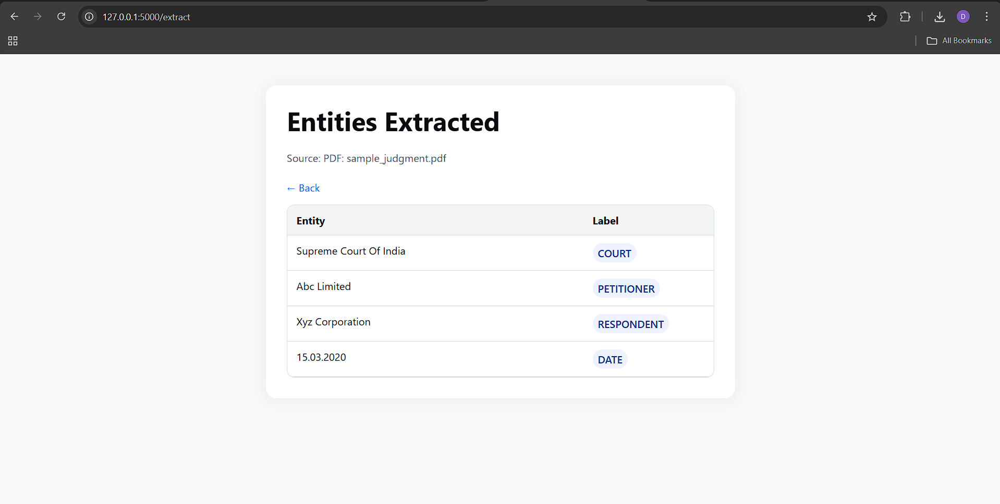

## Legal NER – Extract Entities from Legal Documents

A lightweight Flask web app that performs Named Entity Recognition (NER) on legal documents. You can upload a PDF or use the web‑scraping tab to process online judgments, and the app extracts entities like Court, Petitioner, Respondent, Dates, and more using a spaCy‑based model.

### Demo Screenshots

Save your screenshots at the following paths so they render in this README:
- `static/screenshots/home.png` (Home – upload view)
- `static/screenshots/results.png` (Results – extracted entities)





### Features
- Upload a PDF and extract legal entities
- Simple, modern UI
- Optional web‑scraping tab for online sources
- Post‑processing utilities to clean results

### Project Structure
```
legal_NER/
  app.py
  legal_ner.py
  data_preparation.py
  postprocessing_utils.py
  run_inference.py
  requirements.txt
  templates/
    index.html
    results.html
  static/
    styles.css
    main.js
    screenshots/           # put screenshots here → home.png, results.png
  training/
    config.cfg
    Combined_Data_Judgement_Preamble_spacy_format/
      train.spacy
      dev.spacy
      labels/ner.json
  uploads/
```

### Prerequisites
- Python 3.10+
- Windows, macOS, or Linux

### Setup
```
cd legal_NER

# 1) Create and activate a virtual environment
python -m venv venv
# Windows
venv\Scripts\activate
# macOS/Linux
source venv/bin/activate

# 2) Install dependencies
pip install -r requirements.txt

# If you have a custom spaCy model, install/link it here
# Example: spacy download en_core_web_trf (or your legal NER model)
```

### Run the app
```
python app.py
# The app runs at http://127.0.0.1:5000
```

### How to use
1. Open `http://127.0.0.1:5000` in your browser
2. Go to the PDF Upload tab, choose a file, and click Upload
3. Review entities on the results page

### Notes on large files and Git
- Do not commit your `venv/` or large model binaries to Git. They are already added to `.gitignore`.
- If you accidentally committed large files before, remove them from history with a tool like `git filter-repo`, then force push.

### License
This project is for educational/research use. Adapt as needed for your organization.


